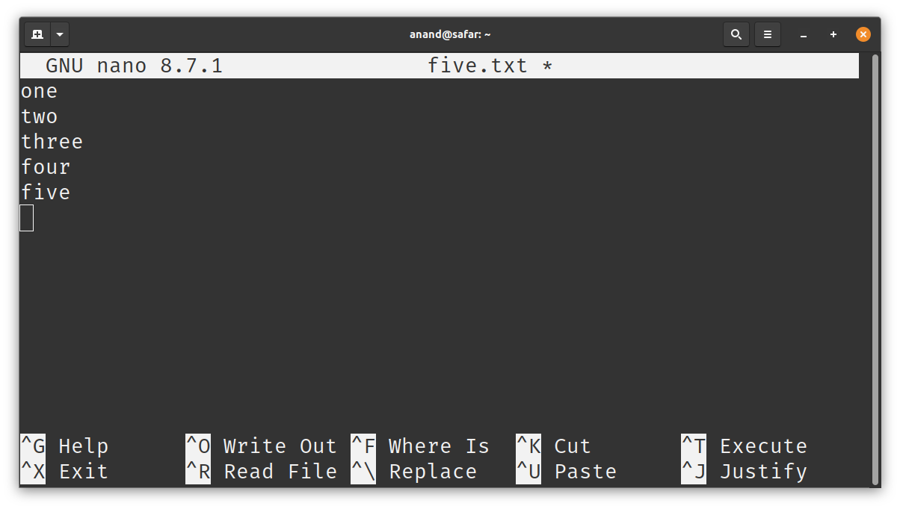
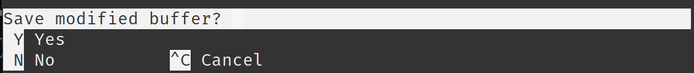
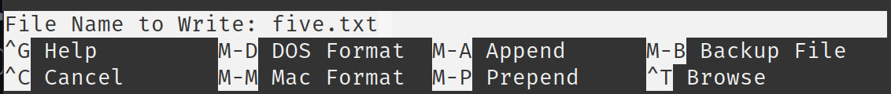

For creating text files and programs, we need a way to edit files. There are two ways to do this. 

Using a unix native editor like `nano` or use modern editor Visual Studio Code. This session introductions both of them.

## The `nano` Editor

`nano` is one of the built-in editors that comes with most of the unix distributions. It runs in the command-line, so you don't need to go anywhere else to make edits to files. 

To edit a file, you run the command `nano filename`. For example, to create or edit file `five.txt`, you run `nano five.txt`.

```session
$ nano five.txt
```

And that would replace the terminal with something like this:



You enter the text that you want in the editor and press `Ctrl+X` (hold control key and press x). That would prompt you something like this:



Once you press `y` to confirm, it will prompt you for filename. Press `Enter` to save the file with the default name.



Now the file is saved.


```session
$ cat five.txt
one
two
three
four
five
```

## Install Visual Studio Code

Visual Studio Code (vscode) is a popular modern editor. It allows you to work with multiple files at once and switch between files easily. You can install it from [Visual Studio Code Downloads][2] page.

[2]: https://code.visualstudio.com/download


### Install WSL Extension in vscode

Once you install vscode, open it and follow the following instructions to install the extension to connect to WSL directly from vscode. 

* Open `vscode` and press `Ctrl+P`
* Type `ext install ms-vscode-remote.remote-wsl` and press `Enter`

_More instructions are coming soon..._